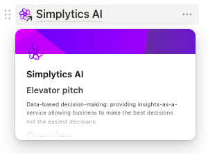

*An evergreen CV of*  
# Alex Bradner

> ℹ️ **This document is always accessible at [cv.alexbradner.com](https://cv.alexbradner.com)** (or [github.com/abradner/cv/blob/main/Alex_Bradner.md](https://github.com/abradner/cv/blob/main/Alex_Bradner.md))  
Rather than printing or exporting this as a [PDF](https://raw.githubusercontent.com/abradner/cv/refs/heads/main/Alex_Bradner.pdf), **please consider directly linking to the URL above**. You'll have the freshest version of this evergreen document.  
I've broken this document up into sections and it's unlikely you'll want to read it all in one sitting. **Use the table of contents below to jump around.**
>
> If you're viewing this on Github, click  in the top right of this document for easier navigation
## Contact me

[LinkedIn](https://www.linkedin.com/in/alexbradner/) is the best way to reach me

## Overview

### TL;DR <small>// too long; didn't read</small>

* [Current Employment](#aug-2024---now--atlassian-principal-engineer)
* [Technical Skills](#technical-proficiencies--experiences)

My expertise is spread across these pillars:
* **Leadership** (Engineering & Product)
* **Software Engineering** (Modern technologies, from bare metal to customer, including DevOps)
* **Architectural design** (Software systems)
* **Product Devlopment** (Product/feature discovery & UX research)
* **Data Science** (Insight generation, Warehousing, ML & AI model creation & training)
* **Startups** (SaaS Startups, Business Administration & Venture Capital)

More detail in the sections below:

### Contents

* [Attributes](#attributes)
* [Skills](#skills--qualifications)
  * [Technical Skills](#technical-proficiencies--experiences)
* [Values](#values--philosophies)
* [My Experience](#my-experience)
  * [Current Employment (quick glance)](#aug-2024---now--atlassian-principal-engineer)
  * [Past Roles](#nov-2023---now--simplytics-ai-founder)
  * [Digging Deeper into Details](#recent-experience---details)
* [Peer & Manager Feedback](#recent-feedback)
* [Other Projects & Impact](#other-projects--impact)
* [A bit more about me](#hobbies--interests)

## Attributes

* Citizen of Australia and Ireland
* Right to live & work in EU, AU, UK, NZ
* 37, Male (He/Him)
* Can drive / ride comfortably on either side of the road
* I like to try my hand at anything (but dexterity is my [dump stat](https://slangit.com/meaning/dump_stat))
* Weakness for good coffee, cheeses, and most aromatic & fermented foods (kimchi, kombucha, miso, wine, whiskey... you get the idea)

## Skills & Qualifications

### University

* BSc (Computer Science) - University of New South Wales Australia (2013)

### Technical Proficiencies & Experiences

#### Languages & Frameworks

* TypeScript & Javascript with experience including:
  * Node (Azure functions & AWS Lambdas)
  * React (NextJS)
  * React & React Native (using Expo)
* Kotlin & JVM (incl Springboot & Armeria)
* Ruby (incl Rails)
* Python (incl Tensorflow, Pandas, NumPy, SciPi)
* There are others, but these I consider "Fresh"

#### Technologies

* Docker & Kubernetes
* SQL (Postgres, Snowflake, Hasura)
* GraphQL & REST API Development
* GRPC Protobuf

#### Data Pipeline, aggregation & Search

* Elastic Search
* Algolia / Search.io
* Splunk
* DBT
* Amazon Sagemaker

#### DevOps

* AWS
* Azure
* Spinnaker CD
* CircleCI (CI & CD)
* Prometheus & Grafana
* Terraform

#### Misc

* Certified Scrum Master
* First Aid

## Values & Philosophies

### Toward People

* Listen, understand, learn, grow.
* Be kind, clarify miscommunications and be willing to forgive.
* Uplift your peers and juniors to be their best.
* Be gentle but firm with your convictions. At the same time be able to explain why you hold them.
* Be aware of your biases. They can add colour to your perspective but don't let them harm others.
* Fostering diversity & inclusion is the responsibility of the already-included, not the diverse.

### In Engineering

* Don't use black boxes - Understand the strengths and limitations of your tooling.
* Write code for the eventual reader.
  * Be expressive, clear and accessible.
  * Optimise where relevant but make those decisions obvious and easy to understand.

### In Business

* Always ask 'Why?' (and don't stop until there is a satisfying explanation).
* Hypothesize, validate and iterate. Ideally before any code is written.
* Maximise customer impact - We build products and write software for them, not us.
* Relatedly:
  * Find opportunities for customer delight where possible.
  * Understand both the opportunity cost and value of tradeoffs. Make tradeoffs aggresively if it directly serves impact.

## My Experience

### Where I've worked (at a glance)

#### Aug 2024 - Now — Atlassian (Principal Engineer)

> You've used Atlassian products before – most likely Jira & Confluence, maybe Trello or Loom – but let me take you behind the curtain where I can:

As a remote-first workplace serving organisations of all sizes (from SMB to government enterprise), Atlassian focuses on helping teams get work done.

I’ve been providing engineering expertise and leadership as a Principal Engineer within Atlassian’s Teamwork Platform, where we build the behind-the-scenes technology that seamlessly connects Jira, Confluence, and other Atlassian tools (plus third-party apps).

This work allows users to embed and interact with content across products without juggling multiple windows or losing context, and it creates a rich knowledge graph that fuels our AI capabilities.

##### More details below

* [My role and experience](#atlassian)
* [Recent peer feedback](#recent-feedback)

Top Tags:

* Business: `enterprise`, `remote-first`, `productivity`, `b2b`, `platform`
* Tools: `jira`, `confluence`, `generative AI`, `smartlinking`
* Technologies: `kotlin`, `typescript`, `javascript`, `react`, `java`, `aws`, `monoliths`, `microservices`
* Skills: `team formation`, `team managment`, `strategy`, `roadmapping`, `achitectural design`, `problem solving`, `risk management / mitigation`, `remote`

#### Nov 2023 - Now — Simplytics AI (Founder)

> SME is awful at data-based decisions. Simplytics AI guides product teams to the right insights from customers’ behaviour
> 
> *Build and understand your analytics stack with a helping hand guiding you along the way. Receive insights that can be used to better drive customer engagement and retention. Ask the right questions and get meaningful answers.*
> 
> *It's Data Driven Decisions: Democratised.*
> 
> *Learn more at [simplytics.ai](https://simplytics.ai)*

##### Founder & CEO

Top Tags:

* Business: `startup`, `consumer`, `b2b`, `early-stage`, `remote-first`
* Technologies: `generative AI`, `python`, `typescript`, `react`, `node`, `sql`, `dbt`, `snowflake`, `aws`, `k8s`
* Skills: `leadership`, `strategy`, `customer development`, `risk management`, `product design`, `remote`, `governance`

**more details [below](#simplytics-ai)**

#### Sep 2022 - Nov 2023 — AirRobe (Principal Engineer)

> AirRobe is focussed on reducing the negative impacts of fast fashion by making buying and selling your pre-loved fashion painless and safe.

As a three-sided marketplace (buyer, seller and theoriginal merchant partner), it's almost impossible to deliver a great experience for everyone given the natural conflict between all three parties, but understanding that razor's edge is what makes AirRobe the best marketplace for everyone (especially the environment) to experience the circular economy.

Top Tags:

* Business: `startup`, `three-sided-marketplace`, `sustainability`, `consumer`, `b2b`, `growth`, `remote-first`
* Technologies: `ruby`, `rails`, `typescript`, `react`, `node`, `aws`, `ios`, `sql`, `dbt`, `snowflake`, `terraform`
* Skills: `leadership`, `strategy`, `mentoring`, `risk management / mitigation`, `product design`, `remote`

**more details [below](#airrobe)**

#### Apr-Sep 2022 — CBA / x15 Ventures: Cheddar  (Principal Engineer)

> Cheddar was CBA's answer to Shopback, Cashrewards and other similar platforms. It had two key driving principals: Find and engage with a new audience (specifically Gen Z) for CBA & merchant partners, and provide that audience with a compelling shopping experience as a gateway to other CBA products and services.

##### Principal Engineer

While the business model was a well-trodden path, being an x15 venture allowed me to bring my startup experience to bear. I was building user-focussed product, training, mentoring and growing the engineering team all whilst navigating the complexities of working within one of the largest and most trusted enterprise brands in the country.

Top Tags:

* Business: `startup`, `fintech`, `consumer`, `b2b`, `enterprise`, `remote-first`
* Technologies: `typescript`, `react`, `node`, `azure`, `ios`, `sql`, `hasura`, `terraform`
* Skills: `leadership`, `strategy`, `mentoring`, `risk / mitigation`, `remote`

**more details [below](#recent-experience---details)**

#### 2017-2022 — Airtasker (Multiple roles)

> Airtasker is the go-to place for getting something done (or maximising the value of from your skills and experience). As a high-paced services marketplace where each side has conflicting desires, Airtasker is the ultimate example of finely understanding and balancing all the customers' needs to create a trusted platform that delivers the best outcome for both sides.

##### Roles including

* Technical Lead (Growth, Customer/Tasker Matching, International Markets, Services Promotion & Discovery)
* Acting Technical Lead (Internal Tooling)
* Senior Engineer (Acquisition, International)

Top Tags:

* Business: `two-sided marketplace`, `consumer`, `growth`, `startup`, `international`
* Technologies: `ruby`, `rails`, `kotlin`, `python`, `sql`, `aws`, `kubernetes/k8s`
* Skills: `technical leadership`, `scrum-master`, `mentoring`, `on-call`, `remote`

**more details [below](#recent-experience---details)**

#### 2014-2017 — Foogi Smart Scheduling

CTO & Co-Founder of my own startup that successfully secured over US$400k of seed funding and *almost* was acquired by Microsoft  
A little more detail is available [here](https://alexbradner.com/#projects)

#### 2012-2013 — Central China Normal University

English language teacher & Computer Science tutor (during exchange)

#### 2010-2012 — Intersect Australia

Sysadmin, QA Tester and finally Junior Engineer

#### 2008-2010 — Haymarket Media

Technical Copywriter on the following mastheads:

* PC Authority (Online, Magazine)
* Atomic - Maximum Powered Computing (Online, Magazine)
* ITNews (Online)

#### Before 2008

Various part time jobs including customer service operator, maths tutor and technical support

### Recent Experience - Details

#### Atlassian

Continued from [above](#aug-2024---now--atlassian-principal-engineer)

My tenure so far has been short, but I have been exposed to (and required to take responsibility for) many concerns in domains across the entire company.

My team is responsible for smart-linking between products, enabling rich interactions and content association across both the Atlassian ecosystem and any relevant third-party datasources.

> ##### ℹ️ What's a smart link?
>
> A rich link to another resource (a page, ticket, file, figma design, etc) built from pasting a simple url.
>
> It not only provides the user with the ***right amount of information*** where they need it, it provides a ***context-rich connection*** between these two resources allowing AI assitive tools (in this case Atlassian's Rovo) to ***build better knowledge and provide better answers***.
>
> e.g.
>
> 

##### My Role

###### Leadership & People Management

* Immediately took on leadership responsibilities of Engineering Manager for a 15-person team during a parental leave
* Reformed the team, normed and restablised processes after major org restructure on day 0 (during onboarding week)
* Mentored junior and senior engineers through regular feedback, architecture and code reviews, pairing and sparring sessions.

###### Craftsmanship

* Implemented significant changes to Tier 1 & 2 services, finding opportunities to reduce the risk of complex changes whilst maintaining velocity.

###### Direction & Impact

* Developed a deep understanding in many unfamiliar domains, allowing me to make better, more impactful decisions.
* Drove architecture discussions to improve platform capabilities driven by both internal and external customers' needs.
* Delivered key improvements informed by these architectural discussions, allowing new customers to consume the platform.
* Planned coarse and fine-grained engineering roadmaps, optimising for impact and risk mitigation.

###### Breadth of Domain

* Worked with engineering teams and contributed to codebases across multiple product domains (Jira, Confluence, Bitbucket, Rovo, Teamwork Platform) in order to balance and advocate for the needs of customers and stakeholders
* Provided OnCall support to stakeholders in these domains to allow them to contribute functionality to our platform
* Worked to ensure our software was and continued to be US Government FedRAMP compliant

[Recent peer feedback](#recent-feedback) available below

#### Simplytics AI

* Founder - Building a business from Idea to MVP to paying customers (soon)
* Customer & problem discovery
* Data Driven Decisions Democratised. Build and understand your analytics stack with a helping hand guiding you along the way. Receive insights that can be used to better drive customer engagement and retention. Ask the right questions and get meaningful answers.
* Building (from scratch):
  * The entire product software stack
  * Branding, marketing & SEO

#### AirRobe

* Head of Engineering, with a valued perspective on product design
* Developed decision-making rigour in the product team to make decisions based on insights from our business' needs and customers' behaviour
* Built and iterated on an end-to-end preferences & personalisation suite to turn on-platform customer behaviour into populated feeds and marketing emails based on taste and recent activity.
* Worked closely with my team to foster areas of interest and build SMEs to create a diversity of expertise

* payment gateways, stripe & fraud mitigation
* Understanding, designing, building, and communicating the product changes that lead to the best outcomes for buyers, sellers and merchants

#### Cheddar

* High level engineering architecture, design & strategy
* Coordination with different functions within the business to ensure we are able to rapidly deliver and iterate impactful customer-facing changes
* Day-to-day writing client & platform/service code to deliver features
* Cultivating engineering culture and best practices in a fully remote & distributed team
* Incident response, management and mitigation
* More generally: working within the biggest bank in Australia and the rigour that requires

#### Airtasker

* Team technical lead for 4 teams since 2018
* SME organisational group (aka 'School') leader and force of change across 3 major disciplines
  * Promoting knowledge sharing & collaboration between engineers working on backend services
  * Driving adaptation to be a full remote-friendly workplace
  * Piloting and improving On Call (including being one of a small handful of solo operators for the platform)
* Deep domain understanding across a broad range of disciplines:
  * SEO, acquisition channels and customer activation
  * International Expansion (incl operational concerns, platform localisation and nitty gritty like timezones and GIS)
  * Data pipelines, recommendation engines, search & dicovery

## Recent Feedback

From Latest Atlassian Feedback Cycle - Mid Jan 2025

(Only \[*modifications*] are to remove sensitive or paraphrase context-dependent information. Names are surpressed but available on request)

> I had the pleasure of working with Alex on the service consolidation project last quarter and was impressed by the strengths he brought to the table.
>
> **Quick Learner:** Despite joining Atlassian recently, Alex quickly familiarised himself with our service capabilities, including \[*services across five domains*]. His rapid onboarding was instrumental in framing solutions, addressing incidents, and providing valuable ad-hoc feedback in the channel.
>
> **Scalability-Focused Solutions:** Alex demonstrated a strong Principal Engineer mindset, proposing a solution for \[*a top-line project*] that not only addressed the immediate challenges but also considered future scalability. This forward-thinking approach ensured the project’s long-term success and highlighted the importance of keeping the bigger picture in mind — a valuable learning for me personally.
>
> Alex’s adaptability and strategic thinking were pivotal, and I look forward in seeing the project reach its final goal.
>
> -- N

> Alex has been driving significant impact right after joining, demonstrating his capabilities in owning the technical evolution of our systems aligned with department goals.
>
> He has been navigating the challenging migration of \[*internal services*] as we consolidate these services. He has shown strong domain expertise through making necessary >
architectural adaptations to our services, all of which he investigated and validated prior, in a short timeframe.
>
> Furthermore, he has directly delivered many complex changes and provided well thought out advice and timely feedback to others including myself on the project to ensure >
incremental solution delivery proceeds without a hitch as planned.
>
> Outside of this direct project, Alex consistently provides insightful feedback drawing on his wealth of experience as well as to many other people’s \[*proposed project designs and architecture*]. Amazing work!
> 
> -- R

> Alex is a strong engineer who is great at collaboration and finding scalable solutions to complex problems.
>
> **PROJECT IMPACT**; **DIRECTION**
>
> Alex has been driving “Service reduction” project to reduce the cost of Smart Links services. During the project, Alex proposed a well thought-through approach for integrating smart link \[*business logic*] into \[*a fit-for-purpose alternative service*].
>
> He suggested a scalable solution for complex use-cases that will benefit not only this project, but further projects and teams that need to orchestrate \[*business logic behaviours*]. He ensured changes are being delivered incrementally, and promptly escalated risks and issues. Notably, Alex added “stub“ actions and functionality to define the architecture of the solution which helped to parallelise the work for engineers on his team.
>
> **TECHNICAL PROFICIENCY**
>
> Alex showed great technical proficiency in the code contributions to \[*replacement service*], leading not only his team, but also \[*a sister team*] team by example. His changes demonstrated deep knowledge of kotlin, design patterns and engineering best-practices.
>
> -- M

> Joining the team during org and team changes, Alex played a key role in ensuring the team will run smoothly in the new format. He collaborated with principal engineers to make sure we have the right processes in place, \[*driving multiple team rituals*] and collaborated on the Q2 roadmap.
>
> Alex has brought to my attention several instances within \[*internal services*] where we are not adhering to best practices, such as buried business logic and circular references. He suggested organizing a session with the team, and I believe this could have a substantial impact by proposing alternatives that would enhance the maintainability of \[*internal services*].
>
> -- A

## Other Projects & Impact

* AirRobe Personalisation & Recommendation Engines
  * Challenge: Keep customers sticky by showing them things that we know they like
  * Problem 1: We don't have a good understanding of what they like
  * Problem 2: We don't have any mechanism to surface relevant things even if we did know.
  * Outcome: Tooling that:
    * tracks and weighs customer interactions (purchases, wishlists, views, searches etc) with different items in our inventory, 
    * aggregates interest based on numerous facets (eg brand, department, size, colour, material etc)
    * creates interest graphs for each user
    * uses the interest graph to query our latest inventory
    * presents a curated selection to customers in a number of different formats (email, feeds etc)
  * Delivered 10x engagement over manually curated emails and feeds
* Airtasker SEO Engine
  * The architectural backbone for this is still the core of SEO landing page generation at airtasker - our primary acquisition channel in both growing and established markets
* Two fundamentally different recommendation systems that have each produced major uplift in conversion from their launch:
  * Providing real-time relevent task recommendations to taskers (workers) in a very fast-moving marketplace where seeing a task 5 minutes late can mean loss of a job
  * Providing qualitative and quantitative recommendations of services to potential customers where little is known about the customer's intent beforehand
* International Launches - 4 countries in different capacities
  * UK - Senior Engineer & Man with many hats post-launch
    * UX research
    * Local product & engineering support
    * de facto engineering product owner whilst in London
  * NZ & Singapore - Technical lead & acting product manager
  * USA - Technical lead, acting product & business operations manager
    * While all have provided major growth opportunities, delivering the US launch despite management hesitency allowed Airtasker to acquire & integrate a local services marketplace startup that is now the grass-roots backbone of our fastest growing market in the world

## Hobbies & Interests

This is broad. The world is my niche and I can find something interesting in so many domains.
Feel free to ask me about one of these or throw me down the rabbit hole with something new and fascinating:

### Technology & Engineering

* Generative AI (designing, building, training and applying)
* Electronics & circuit design
* 3D CAD modelling (Fusion 360, openSCAD, SolidWorks)
* Physical prototyping & 3D printing (FDM & Resin-based)
* Mechanical engineering & the future of manufacturing
* Home automation
* Self-hosted SaaS
* Data modelling

### The Mind & Body

* Behavioural psychology & neurobiology/chemistry
* Genetic expression, endocrinology & immunology
* Mental health and disorders
* Developments in mental health research

### Social Impact

* Political advocacy
* Environmentalism
* History

### Downtime

* Reading / watching: Sci-fi and fantasy epics
* Gaming: Board, Tabletop RPG, PC, Switch
* Making (crappy) music
* Being a dog parent

### Outside

* Growing green things
* Camping and disconnecting
* Agritech

### Movement

* Yoga (Yes I'm a walking stereotype sometimes. What's your point?)
* Cycling (Road, mountain and motorbike)
* Swimming
* Scuba diving

### Creativity

* Photography & videography
